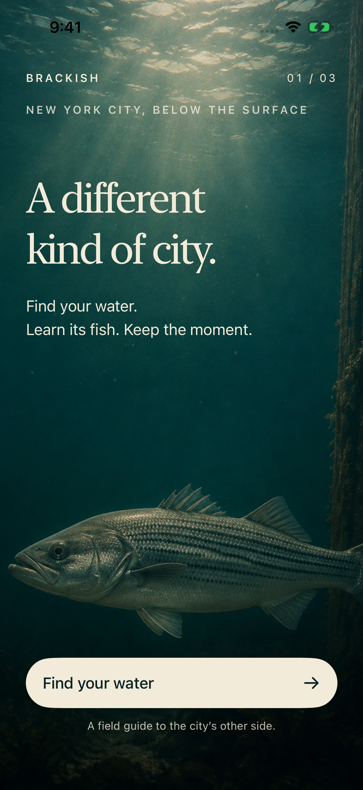
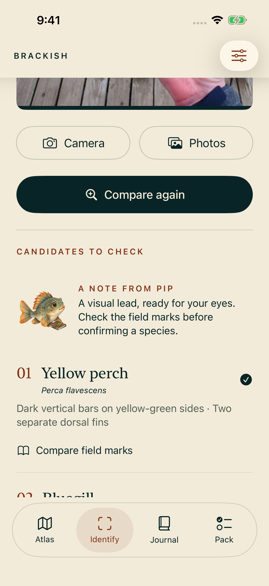
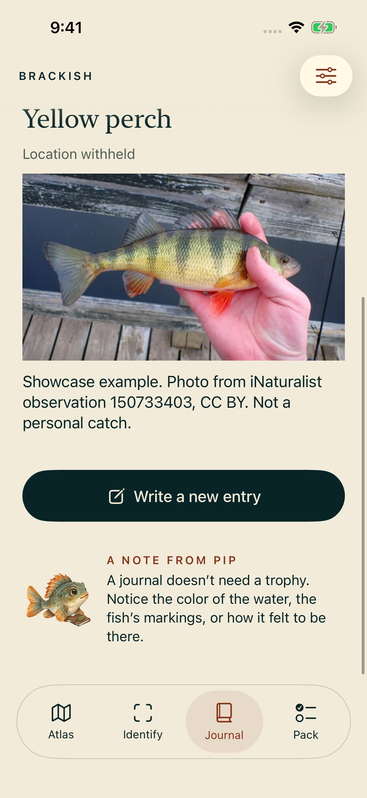

# Brackish — NYC fishing field journal

Native SwiftUI, original underwater art, a private on-device photo comparison,
seven curated NYC shore locations and a personal catch journal. Built with GPT-6 Astra.
No service credentials are required.

| Arrival | Identify | Field journal |
|---|---|---|
|  |  |  |

These are actual simulator captures. The journal example uses an attributed
evaluation photograph, not a personal catch. New installations start empty.

Start with [the project README](outputs/Brackish/README.md),
[validation](outputs/Brackish/Docs/VALIDATION.md), and
[the model card](outputs/Brackish/Docs/MODEL_CARD.md).

The Xcode project, editable art originals, generation prompts, licenses, tests and
evidence are in [outputs/Brackish](outputs/Brackish). Photo suggestions are experimental
and require manual confirmation. Physical-device accuracy/performance are not claimed.
The foreground simulator motion review is complete.
[Watch the actual app walkthrough](outputs/Brackish/Evidence/Brackish-walkthrough.mp4).
Physical-device and sustained 60 fps claims remain unverified.
